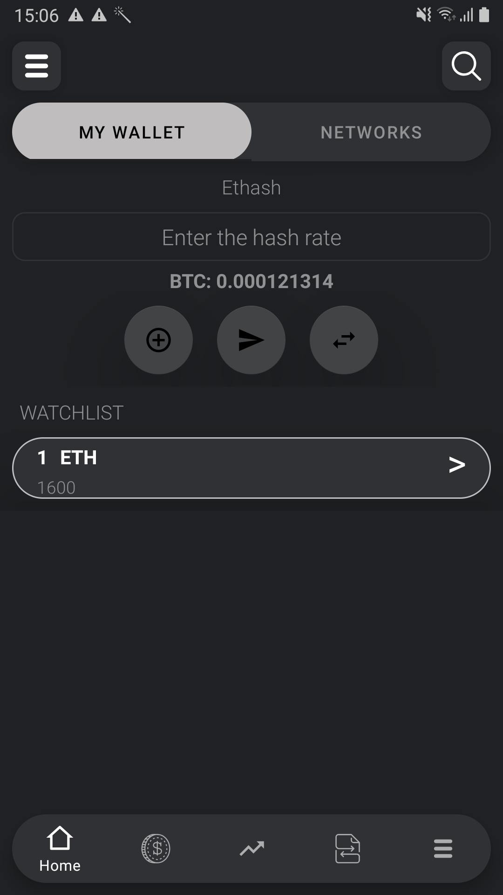
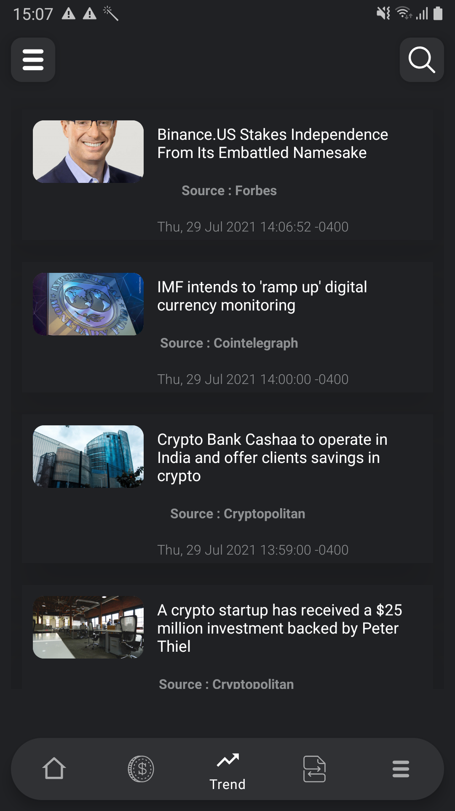
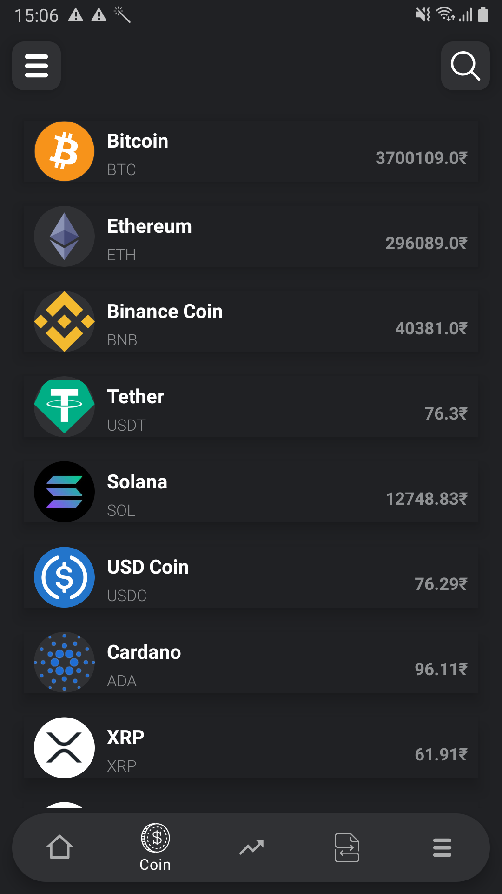
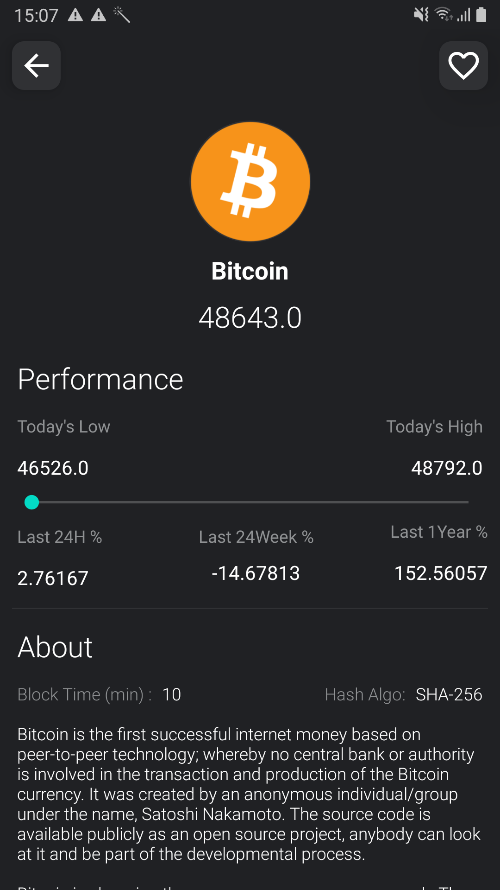
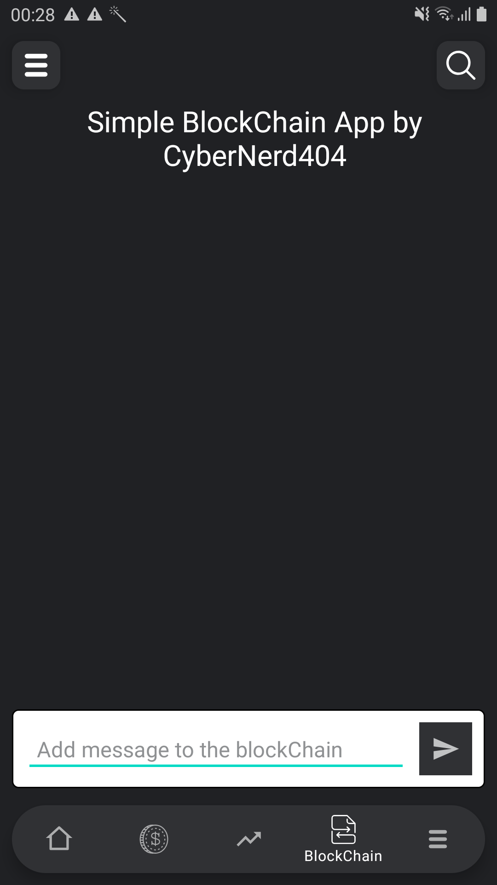
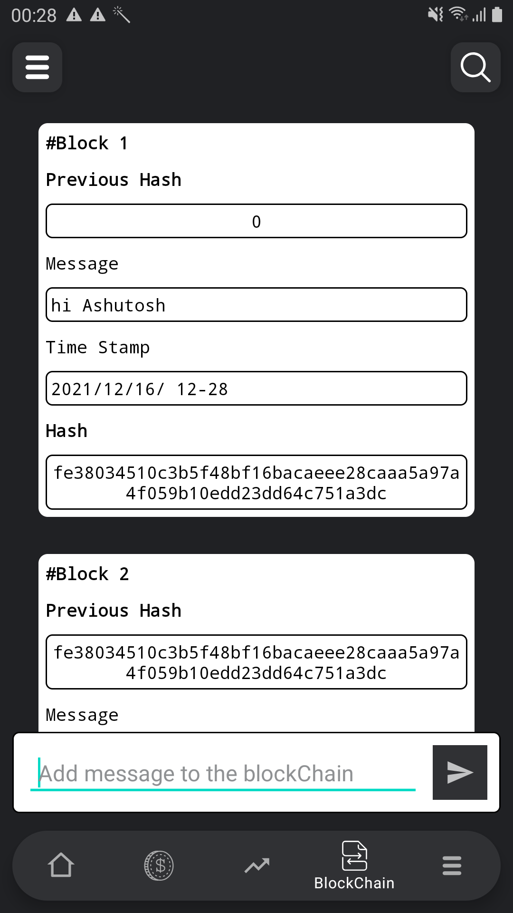

# CryptoX

**CryptoX** is an Android application 📱 it is with *Modern Android development* tools. Developed by CyberNerd. 
*CryptoX is an Associate Crypto Currency coin app for News, Tweets, Blogs and Coin Information. I have used free CoinGecko API for more details please visit http://www.coingecko.com

## support our work and do Star this Repository Or Fork this Repository

     
   

## About
It simple Crypto Currency Companion App, Wants to make this as a software crypto currency wallet ( work in progress ) which will interact with Etherium Blockchain and It also contains News and Blogs.

     
                                                

## Coins
Listing of all the crpto coins with pricing ( it supports multiple currency ).

     
                                                

## BlockChain
Add or Write Message to understand the basic blockchain functionality.

## Setup :-> Clone the Repository and build the project. That's it!

## Built With 🛠
- [Kotlin](https://kotlinlang.org/) - First class and official programming language for Android development.
- [Coroutines](https://kotlinlang.org/docs/reference/coroutines-overview.html) - For asynchronous and more..
- [Android Architecture Components](https://developer.android.com/topic/libraries/architecture) - Collection of libraries that help you design robust, testable, and maintainable apps.
  - [LiveData](https://developer.android.com/topic/libraries/architecture/livedata) - Data objects that notify views when the underlying database changes.
  - [ViewModel](https://developer.android.com/topic/libraries/architecture/viewmodel) - Stores UI-related data that isn't destroyed on UI changes. 
  - [ViewBinding](https://developer.android.com/topic/libraries/view-binding) - Generates a binding class for each XML layout file present in that module and allows you to more easily write code that interacts with views.
  - [Room](https://developer.android.com/topic/libraries/architecture/room) - SQLite object mapping library.
- [Retrofit](https://square.github.io/retrofit/) - A type-safe HTTP client for Android and Java.
- [Gson](https://github.com/google/gson) - A Java serialization/deserialization library to convert Java Objects into JSON and back
- [Material Components for Android](https://github.com/material-components/material-components-android) - Modular and customizable Material Design UI components for Android

## Contribution 🙏🏻 are always Welcome ( fork this repository and make pull request)**
## Buy Me A Coffee
Ethereum : 0xdC2ac9b66F56eD660eA28c02249eD4138883d169
